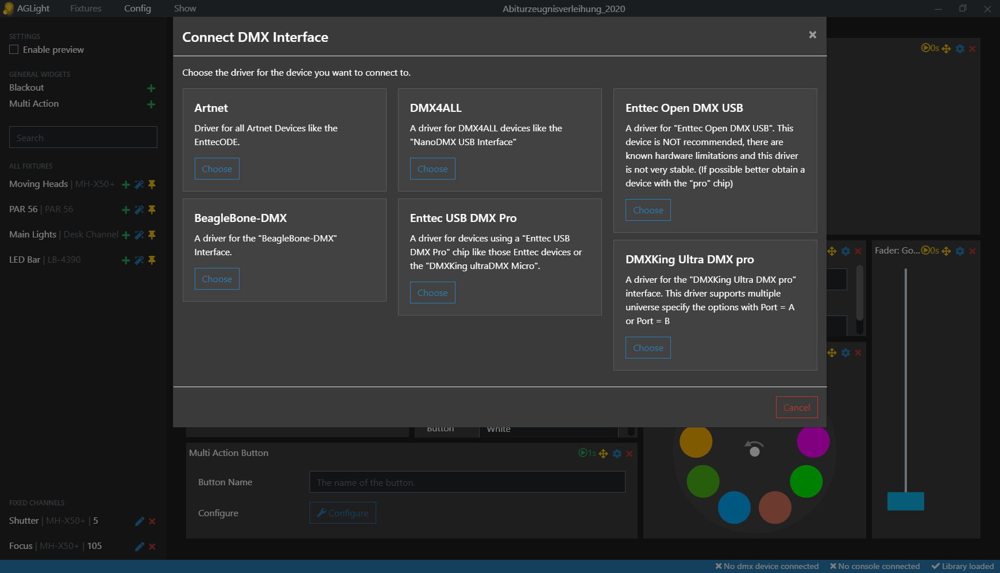

# AGLight 💡

 

## Note: ##
This project is in development. It can't be used as of now!
But feel free to contribute!

## Screenshots
Dashboard | Head Editor | Fixtures
----- | ----- | -----
 |  | 

Configure Show | Drag and Drop| 3D Preview
----- | ----- | -----
 |  | 

## What is it?
AGLight is a intiutive software for controlling DMX lights. You can build the userinterface yourself by adding different widgets via Drag and Drop. Building instructions for a console with physical faders and displays will be available soon.

The Electron Angular App will send over the dmx universe over to different devices. This is done using the excellent [node-dmx](https://github.com/node-dmx/dmx) library. You can see all supported devices [here](https://github.com/node-dmx/dmx/tree/master/drivers).

## Features
* Create your custom UI via Drag and Drop
* Uses the great [OpenFixtureLibrary](https://github.com/OpenLightingProject/open-fixture-library)
* Preview your scene with the 3D Visualizer (in dev)
* Supports the following USB interfaces:
    * All artnet devices like EnttecODE
    * BeagleBone-DMX
    * All DMX4ALL devices like the "NanoDMX USB Interface"
    * All devices with a "Enttec USB DMX Pro chip", like the "DMXKing ultraDMX Micro"
    * Enttec Open DMX USB
    * DMXKing Ultra DMX pro

## How does it work?
### I want to use this software
1. Download a the latest release for your operating system.
2. Install it.
3. Run the setup wizard
4. Have fun!

### I want to contribute
1. Clone this repository by typing `git clone https://github.com/hrueger/AGLight` in your command prompt
2. `cd AGLight`
3. Type `npm start` to start your dev session with LiveSync!
4. Before creating a pull request be sure to check for linting errors with `npm run lint`

#### Add effects
1. All effects are classes stored in `src/app/_ressources/effects`
2. Copy the base effect file and edit all properties and methods.
3. Register your effect in `notexistingyet.ts`