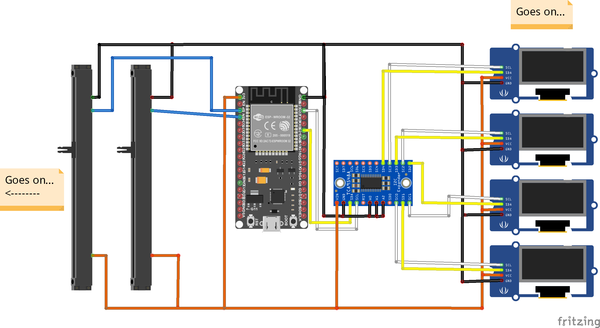

# Hardware
This project also includes a hardware part. A little console with physical faders is built and used to have better control over the faders as they don't have to be moved with the mouse or on the touch screen.

## Schematic
My console uses 8 Faders, 8 Displays and four Push Buttons. Of course you can use other quantities, too, but keep in mind that one I²C Multiplexer is needed for every 8 Displays.

Unfortunately, the analog to digital converter of the ESP32 is not great (it can't read very low voltages), so external AD converters have to be used.

## Parts List

| Quantity | Description | Product name | Link | Price per piece | Total |
| - | - | - | - | - | - |
| 8 | Faders | 10PCS 75mm Behringer Mixer Fader B10K Dual Double Straight Slide Potentiometer | https://www.ebay.com/itm/133091704050 | $7.15 for 10 | $7.15 |
| 8 | Fader Knobs | 10pcs 8mm Fader Knob Cap Touch Sensitive Slider Ribbed Mixer Desk Gxn IJ | https://www.ebay.com/itm/233223146578 | $4.80 for 10 | $4.80 |
| 1 | ESP 32 | ESP-WROOM-32 ESP32 ESP32S 2.4GHz WiFi Bluetooth Development Board for Arduino | https://www.ebay.com/itm/183688068095 | $4.88 | $4.88 |
| 8 | OLED Displays | IIC I2C/SPI 0.49/0.69/0.91/0.96/1.3"inch OLED Module Display Screen For Arduino (0.96 inch IIC I2C Variant) | https://www.ebay.com/itm/264392006596 | $3.92 | $31.36 |
| 1 | I²C Multiplexer | TCA9548A I2C IIC Multiplexer Breakout board | https://www.ebay.com/itm/301961829956 | $1.95 | $1.95 |
| 3 | AD Converter | ADS1115 4 CHANNEL 16 BIT I2C ADC MODULE | https://www.ebay.com/itm/352638444982 | $1.79 | $5.37 |
| 4 | Push Buttons | Honyone TS26 Series Square Momentary With LED SPST PCB Push Button Tact Switch (15mm*15mm Variant) | https://www.ebay.com/itm/184024849831 | $1.66 | $6.64 |
| | | | | Total: | $62.15 |

Prices were calculated on 12/03/2019.